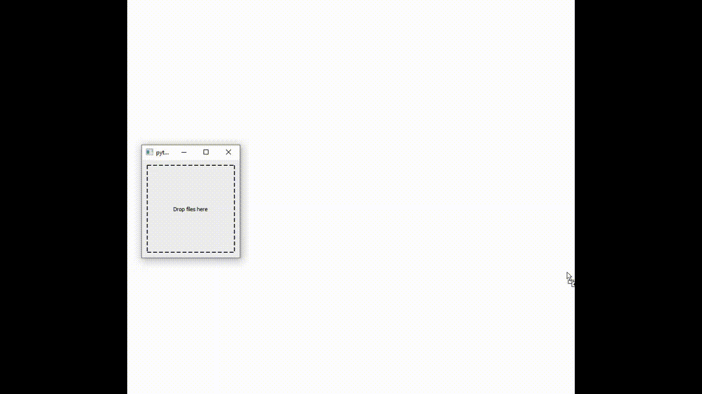
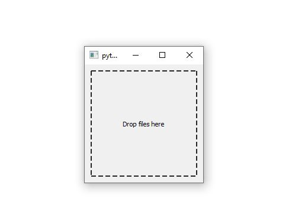

# Create an Executable Program to Quickly Check Raster Files

*Created by Zhen Liu*  
Have questions about this tutorial? Email me at: [zhenliu3@clarku.edu](zhenliu3@clarku.edu)

## Introduction
Have you ever been in a situation that you only want to check a raster file but don't want to open a big software, like ArcGIS Map? If your answer is Yes, this light computer program is just what you need. The program can open a raster file quickly and the user can check the statistics of the file. The video below shows how the program works. The user drag the file and drop it in the program. The image and its statistics will be automatically displayed.
  
In this tutorial, I will show you how to create it in Python.We are going to use several useful libraries in Pythons. There are PyQt5, Gdal, Matplotlib, and PyInstaller.

## Set up
Before we start coding, we need to install the libraries we need. The most common way is to use **pip** command. Open the terminal, type the commands below to install the required libraries.
```
pip install PyQt5
pip install gdal
pip install matplotlib
pip intsall PyInstaller
```
If you cannot install any of them in your environment, I recommend the other way to install libraries. we can download .whl file in the [website](https://www.lfd.uci.edu/~gohlke/pythonlibs/). Please be careful of the version and requirements when you download the file. For example, GDAL‑3.0.4‑cp36‑cp36m‑win_amd64.whl incicates that the version of Gdal library is 3.0.4. cp36 indicates the version of Python should be 3.6. amd64 denotes the system type should be 64 bit. After download, write the command in the terminal to install the library. The command should be like:
```
pip install  C:/some-dir/some-file.whl
```

## Step 1. Design the Interface
The first step is to design a user interface for the program. QT library is one of the most powerful GUI libraries. PyQt5 is a set of Python bindings for QT applications. There are two ways to design a interface.  
First, you can use software named Qt Designer. Qt Designer is the Qt tool for designing and building graphical user interfaces (GUIs) with Qt Widgets. You can compose and customize your windows or dialogs in a what-you-see-is-what-you-get (WYSIWYG) manner, and test them using different styles and resolutions. The software can be downloaded at [this](https://build-system.fman.io/qt-designer-download). It also provides a detailed [tutorial](https://doc.qt.io/qt-5/gettingstarted.html).  
The second way is to write code using the libary directly. That's what we do in this tutorial. PyQt5 has a set of useful modules. We are going to use two of them:
* **QtWidgets**: The QtWidgets module contains classes that provide a set of UI elements to create classic desktop-style user interfaces.
* **QtCore**: The QtCore module contains the core non-GUI functionality. This module is used for working with time, files and directories, various data types, streams, URLs, mime types, threads or processes.

First, import the modules we need. **QApplication** is to manages the GUI application’s control flow and main settings. It should be put in the main function to initialize and finalize the widgets. **QMainWindow** is the class for a framework for building an application's user interface. **QLabel** is the class for the texts in the interface. **QMessageBox** is the class for dialogs. This is a little popup window that you’ve often seen on your desktop. The modules imported from QtCore are supplements for the interface designing.
```
import sys
from PyQt5.QtWidgets import QApplication, QMainWindow, QLabel, QMessageBox
from PyQt5.QtCore import Qt, QUrl, QRect
```

Next, let's go through the code.
```
class Appdemo(QMainWindow):
    def __init__(self):
        super().__init__()
        self.resize(200, 200)
        self.setAcceptDrops(True)
        self.label_1 = QLabel("Drop files here", self)
        self.label_1.setAlignment(Qt.AlignCenter)
        self.label_1.setStyleSheet("border:2px dashed #242424;")
        self.label_1.setGeometry(QRect(10, 10, 180, 180))
if __name__ == "__main__":
    app = QApplication(sys.argv)
    demo = Appdemo()
    demo.show()
    sys.exit(app.exec())
```
- We first generate a class which inherits the functionality from QMainWindow so that we can customize it in the class.
  ```
  super().__init__()
  self.resize(200, 200)
  self.setAcceptDrops(True)
  ```
  - The first code is to initialize the class by the initialization function in QMainWindow. The class Appdemo will have the same functions and appearance as the QMainWindow.
  - The second code is to change the size of window to (200 px, 200 px)
  - The third code is to enable the program to get the file when the user drop and put files on the program.
- However, when the user opens the program, they don't know what to do next. That's why we add a label in the mainwindow. Here is the code.
    ```
    self.label_1 = QLabel("Drop files here", self)
    self.label_1.setAlignment(Qt.AlignCenter)
    self.label_1.setStyleSheet("border:2px dashed #242424;")
    self.label_1.setGeometry(QRect(10, 10, 180, 180))
    ```
    - The first code is to create a label telling users to drop files in the window.
    - The seond code is to make the label center in the window.
    - The third code is to design the border for the label. The border style is "2 px wide, dashed line, and 6-digit color code is 242424".
    - The last code is to locate the label box. (10, 10) is the coordinate of the upper left corner of the label box. (180, 180) is the size of label box.

- In the main function, we create an instance of QApplication, passing in sys.argv, which is Python list containing the command line arguments passed to the application. Then, we create the class (an instance of a QMainWindow using the variable name demo) and show it. Finally, we call app.exec() to start up the event loop. It is good practice to pass on this exit code to sys.exit(). If not, the script will automatically exit after the last line of code has been executed.

Now when you run the code, you can see the interface like this.



When you drag the files to that, it doesn't respond. That's why we need to write event functions. In the class Appdemo, we also need to add two parts of codes.
```
    def dragEnterEvent(self, event):
        if event.mimeData().hasUrls():
            event.accept()
        else:
            event.ignore()
    def dropEvent(self, event):
        ## close all figures
        plt.close('all')
        event.accept()
        url_list = []
        for url in event.mimeData().urls():
            if(url.isLocalFile()):
                res_url = str(url.toLocalFile())
            else:
                res_url = url.toString()
            url_list.append(res_url)
```
- As what we do in the last chunk of codes, the Appdemo class inherits from the QMainWindow class. In the QMainWindow class, there are some events to respond to "drag and drop files". What we should do is to rewrite them as our needs.
- dragEnterEvent is the event which is sent to a widget when a drag and drop action enters it. The code in this event is to check whether it has url, which is the file path. If it has a url, the event will be accepted. If not, the event will be ignored.
- dropEvent is the event which is sent when a drag and drop action is completed. The code in the function is to save all urls. If the file is local files, the code will convert the url to the path. If the file is not on the local computer, the url will be saved without any modification.
- Notice that "plt.close('all')" is put at first. This code is to close all windows showing raster images when the user drop new files in the program. I will talk it in the next section.

## Step 2. Read and Show Raster Files
Now, we have a great interface and we get the file paths for each raster. Then, we need to read those files and display them.

We use Gdal to read images. Gdal is a translator library for raster and vector geospatial data formats. It can read files in multiple formats, like "tiff", "rst", and etc.

Then we convert the data into arrays, so that we can easily calculate the statistics about the raster files easily by the Python library Numpy. Numpy is a library for the Python programming language, adding support for large, multi-dimensional arrays and matrices. It can quickly process the array-like data.

At last, we use Matplotlib to show those data.

The code should be added in the dropEvent.
```
def dropEvent(self, event):
    ## close all figures
    plt.close('all')
    event.accept()
    url_list = []
    for url in event.mimeData().urls():
        if(url.isLocalFile()):
            res_url = str(url.toLocalFile())
        else:
            res_url = url.toString()
        url_list.append(res_url)
    image_num = 1
    for url in url_list:
        img = gdal.Open(url)
        bandarray = img.GetRasterBand(1).ReadAsArray()
        plt.figure(image_num)
        image_num+=1
        fig = plt.gcf()
        fig.canvas.manager.set_window_title(url.split('/')[-1])
        plt.imshow(bandarray)
        plt.axis('off')
        plt.show()
        min = np.min(np.array(bandarray))
        average = np.average(np.array(bandarray))
        max = np.max(np.array(bandarray))
        col = np.array(bandarray).shape[1]
        row = np.array(bandarray).shape[0]
        stats = "row: "+ str(row) + "\n" + "col: "+ str(col) + "\n" + "min: "+ str(min) + "\n" + "max: "+ str(max) + "\n" + "mean: "+ str(average) + "\n"
        # self.stats_message(self, url.split('/')[-1],'hello')
        QMessageBox.about(self, url.split('/')[-1], stats)
```
- Let's start with for loop. This loop will go through every path in the list.
- gdal.Open() is used to open the image file. Then, we get the first band in the tiff file and read it as an array.
- image_num is to count the number of files and set the differnt canvas for images by using plt.figure(image_num)
- ```
   fig = plt.gcf()
   fig.canvas.manager.set_window_title(url.split('/')[-1])
   plt.imshow(bandarray)
   plt.axis('off')
   plt.show()
  ```
  The code here is to show the raster image without axes and set the title as the file name.
- ```
   min = np.min(np.array(bandarray))
   average = np.average(np.array(bandarray))
   max = np.max(np.array(bandarray))
   col = np.array(bandarray).shape[1]
   row = np.array(bandarray).shape[0]
  ```
  Next, we calculate the minimum, maximum and mean values for the raster image. And, the row number and column number can be obtained from the shape property.
- ```
  stats = "row: "+ str(row) + "\n" + "col: "+ str(col) + "\n" + "min: "+ str(min) + "\n" + "max: "+ str(max) + "\n" + "mean: "+ str(average) + "\n"
  QMessageBox.about(self, url.split('/')[-1], stats)
  ```
  Remember, the module QMessageBox is used to show soem dialogs. We want to show the statistics about files before we check the image. That's why we activate a message box at the end of the event.
## reference links
1. The video shows how to use a drag and drop function in PyQt5. https://www.youtube.com/watch?v=KVEIW2htw0A